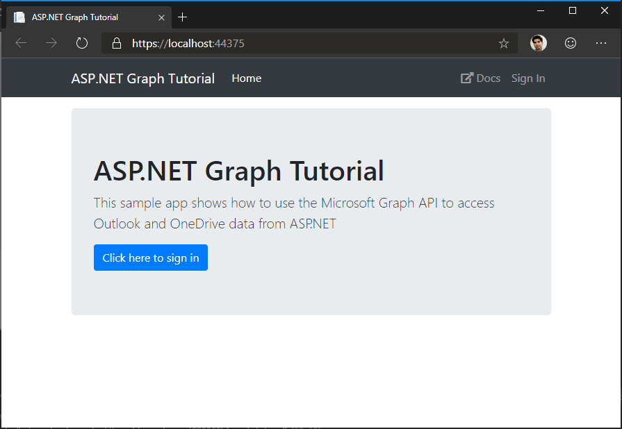

<!-- markdownlint-disable MD002 MD041 -->

打开 Visual Studio, 然后选择 " **File > New > Project**"。 在 "**新建项目**" 对话框中, 执行以下操作:

1. 在**Visual c # > Web**中选择 "模板 >"。
1. 选择 " **ASP.NET Web 应用程序 (.net Framework)**"。
1. 输入**graph-** 项目名称教程。


> [!NOTE]
> 确保为在这些实验室说明中指定的 Visual Studio 项目输入完全相同的名称。 Visual Studio 项目名称将成为代码中的命名空间的一部分。 这些指令中的代码取决于与这些说明中指定的 Visual Studio 项目名称匹配的命名空间。 如果使用其他项目名称, 则代码将不会编译, 除非您调整所有命名空间以匹配您在创建项目时输入的 Visual Studio 项目名称。

选择“**确定**”。 在 "**新建 ASP.NET Web 应用程序项目**" 对话框中, 选择 " **MVC** " (在 " **ASP.NET 4.7.2 模板**" 下) 并选择 **"确定"**。

按**F5**或选择 "**调试" > "开始调试**"。 如果一切正常, 则默认浏览器应打开并显示一个默认的 ASP.NET 页面。

在继续之前, 请更新`bootstrap` NuGet 包, 并安装稍后将使用的一些其他 NuGet 包。

- [Owin](https://www.nuget.org/packages/Microsoft.Owin.Host.SystemWeb/)在 ASP.NET 应用程序中启用[Owin](http://owin.org/)接口的 SystemWeb。
- [Owin](https://www.nuget.org/packages/Microsoft.Owin.Security.OpenIdConnect/)用于执行与 Azure 的 OpenID 连接身份验证的 OpenIdConnect。
- [Owin](https://www.nuget.org/packages/Microsoft.Owin.Security.Cookies/)启用基于 cookie 的身份验证的 cookie。
- 用于请求和管理访问令牌的 " [Microsoft 身份" 客户端](https://www.nuget.org/packages/Microsoft.Identity.Client/)。
- 用于调用 microsoft Graph 的[microsoft](https://www.nuget.org/packages/Microsoft.Graph/) graph。

选择 "**工具 > NuGet 包管理器 > 程序包管理器控制台**"。 在 "程序包管理器控制台" 中, 输入以下命令。

```Powershell
Update-Package bootstrap
Install-Package Microsoft.Owin.Host.SystemWeb
Install-Package Microsoft.Owin.Security.OpenIdConnect
Install-Package Microsoft.Owin.Security.Cookies
Install-Package Microsoft.Identity.Client -Version 2.7.0
Install-Package Microsoft.Graph -Version 1.11.0
```

创建一个基本的 OWIN startup 类。 右键单击 "解决方案`graph-tutorial`资源管理器" 中的文件夹, 然后选择 "**添加 > 新项**"。 选择 " **OWIN" 启动类**模板, 命名该`Startup.cs`文件, 然后选择 "**添加**"。

## <a name="design-the-app"></a>设计应用程序

首先, 为错误消息创建一个简单的模型。 您将使用此模型在应用程序的视图中闪烁错误消息。

右键单击 "解决方案资源管理器" 中的 "**模型**" 文件夹, 然后选择 "**添加 > 类 ...**"。命名该类`Alert` , 然后选择 "**添加**"。 在中`Alert.cs`添加以下代码。

```cs
namespace graph_tutorial.Models
{
    public class Alert
    {
        public const string AlertKey = "TempDataAlerts";
        public string Message { get; set; }
        public string Debug { get; set; }
    }
}
```

现在, 更新应用程序的全局布局。 打开`./Views/Shared/_Layout.cshtml`文件, 并将其全部内容替换为以下代码。

```html
@{
    var alerts = TempData.ContainsKey(graph_tutorial.Models.Alert.AlertKey) ?
        (List<graph_tutorial.Models.Alert>)TempData[graph_tutorial.Models.Alert.AlertKey] :
        new List<graph_tutorial.Models.Alert>();
}

<!DOCTYPE html>
<html>
<head>
    <meta charset="utf-8" />
    <meta name="viewport" content="width=device-width, initial-scale=1.0">
    <title>ASP.NET Graph Tutorial</title>
    @Styles.Render("~/Content/css")
    @Scripts.Render("~/bundles/modernizr")

    <link rel="stylesheet" href="https://use.fontawesome.com/releases/v5.1.0/css/all.css"
          integrity="sha384-lKuwvrZot6UHsBSfcMvOkWwlCMgc0TaWr+30HWe3a4ltaBwTZhyTEggF5tJv8tbt"
          crossorigin="anonymous">
</head>

<body>
    <nav class="navbar navbar-expand-md navbar-dark fixed-top bg-dark">
        <div class="container">
            @Html.ActionLink("ASP.NET Graph Tutorial", "Index", "Home", new { area = "" }, new { @class = "navbar-brand" })
            <button class="navbar-toggler" type="button" data-toggle="collapse" data-target="#navbarCollapse"
                    aria-controls="navbarCollapse" aria-expanded="false" aria-label="Toggle navigation">
                <span class="navbar-toggler-icon"></span>
            </button>
            <div class="collapse navbar-collapse" id="navbarCollapse">
                <ul class="navbar-nav mr-auto">
                    <li class="nav-item">
                        @Html.ActionLink("Home", "Index", "Home", new { area = "" },
                            new { @class = ViewBag.Current == "Home" ? "nav-link active" : "nav-link" })
                    </li>
                    @if (Request.IsAuthenticated)
                    {
                        <li class="nav-item" data-turbolinks="false">
                            @Html.ActionLink("Calendar", "Index", "Calendar", new { area = "" },
                                new { @class = ViewBag.Current == "Calendar" ? "nav-link active" : "nav-link" })
                        </li>
                    }
                </ul>
                <ul class="navbar-nav justify-content-end">
                    <li class="nav-item">
                        <a class="nav-link" href="https://developer.microsoft.com/graph/docs/concepts/overview" target="_blank">
                            <i class="fas fa-external-link-alt mr-1"></i>Docs
                        </a>
                    </li>
                    @if (Request.IsAuthenticated)
                    {
                        <li class="nav-item dropdown">
                            <a class="nav-link dropdown-toggle" data-toggle="dropdown" href="#" role="button" aria-haspopup="true" aria-expanded="false">
                                @if (!string.IsNullOrEmpty(ViewBag.User.Avatar))
                                {
                                    
                                }
                                else
                                {
                                    <i class="far fa-user-circle fa-lg rounded-circle align-self-center mr-2" style="width: 32px;"></i>
                                }
                            </a>
                            <div class="dropdown-menu dropdown-menu-right">
                                <h5 class="dropdown-item-text mb-0">@ViewBag.User.DisplayName</h5>
                                <p class="dropdown-item-text text-muted mb-0">@ViewBag.User.Email</p>
                                <div class="dropdown-divider"></div>
                                @Html.ActionLink("Sign Out", "SignOut", "Account", new { area = "" }, new { @class = "dropdown-item" })
                            </div>
                        </li>
                    }
                    else
                    {
                        <li class="nav-item">
                            @Html.ActionLink("Sign In", "SignIn", "Account", new { area = "" }, new { @class = "nav-link" })
                        </li>
                    }
                </ul>
            </div>
        </div>
    </nav>
    <main role="main" class="container">
        @foreach (var alert in alerts)
        {
            <div class="alert alert-danger" role="alert">
                <p class="mb-3">@alert.Message</p>
                @if (!string.IsNullOrEmpty(alert.Debug))
                {
                    <pre class="alert-pre border bg-light p-2"><code>@alert.Debug</code></pre>
                }
            </div>
        }

        @RenderBody()
    </main>
    @Scripts.Render("~/bundles/jquery")
    @Scripts.Render("~/bundles/bootstrap")
    @RenderSection("scripts", required: false)
</body>
</html>
```

此代码添加简单样式的[引导](https://getbootstrap.com/), 并添加一些简单图标的[字体](https://fontawesome.com/)。 它还使用导航栏定义全局布局, 并使用`Alert`类来显示任何警报。

现在, `Content/Site.css`使用以下代码打开并替换其全部内容。

```css
body {
  padding-top: 4.5rem;
}

.alert-pre {
  word-wrap: break-word;
  word-break: break-all;
  white-space: pre-wrap;
}
```

现在更新默认页面。 打开`Views/Home/index.cshtml`文件, 并将其内容替换为以下内容。

```html
@{
    ViewBag.Current = "Home";
}

<div class="jumbotron">
    <h1>ASP.NET Graph Tutorial</h1>
    <p class="lead">This sample app shows how to use the Microsoft Graph API to access Outlook and OneDrive data from ASP.NET</p>
    @if (Request.IsAuthenticated)
    {
        <h4>Welcome @ViewBag.User.DisplayName!</h4>
        <p>Use the navigation bar at the top of the page to get started.</p>
    }
    else
    {
        @Html.ActionLink("Click here to sign in", "SignIn", "Account", new { area = "" }, new { @class = "btn btn-primary btn-large" })
    }
</div>
```

现在, 添加一个 helper 函数来创建`Alert`并将其传递到视图。 为使我们创建的任何控制器易于使用, 请定义一个基本控制器类。

右键单击 "解决方案资源管理器" 中的 "**控制器**" 文件夹, 然后选择 "**添加 > 控制器 ...**"。选择 " **MVC 5 控制器-空**", 然后选择 "**添加**"。 命名控制器`BaseController` , 然后选择 "**添加**"。 用以下代码替换 `BaseController.cs` 的内容。

```cs
using graph_tutorial.Models;
using System.Collections.Generic;
using System.Web.Mvc;

namespace graph_tutorial.Controllers
{
    public abstract class BaseController : Controller
    {
        protected void Flash(string message, string debug=null)
        {
            var alerts = TempData.ContainsKey(Alert.AlertKey) ?
                (List<Alert>)TempData[Alert.AlertKey] :
                new List<Alert>();

            alerts.Add(new Alert
            {
                Message = message,
                Debug = debug
            });

            TempData[Alert.AlertKey] = alerts;
        }
    }
}
```

任何控制器都可以从该基本控制器类继承以获取对函数`Flash`的访问权限。 更新要`HomeController`从中`BaseController`继承的类。 打开`Controllers/HomeController.cs`并将`public class HomeController : Controller`行更改为:

```cs
public class HomeController : BaseController
```

保存所有更改, 然后重新启动服务器。 现在, 应用程序看起来应非常不同。

