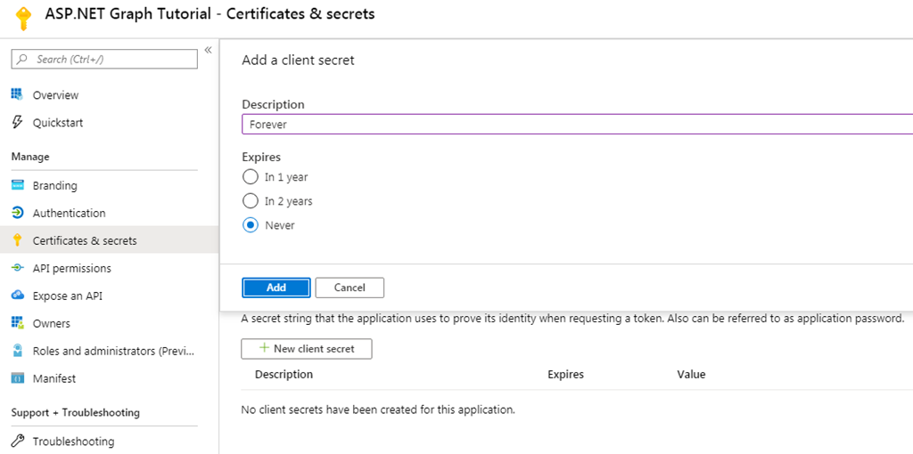

<!-- markdownlint-disable MD002 MD041 -->

在本练习中, 你将使用 Azure Active Directory 管理中心创建新的 Azure AD web 应用程序注册。

1. 确定 ASP.NET 应用的 URL。 在 Visual Studio 的 "解决方案资源管理器" 中, 选择 "**绘图教程**" 项目。 在“属性”**** 窗口中，查找“URL”**** 值。 复制此值。

    

1. 打开浏览器，并转到 [Azure Active Directory 管理中心](https://aad.portal.azure.com)。 使用**个人帐户**（亦称为“Microsoft 帐户”）或**工作或学校帐户**登录。

1. 在左侧导航栏中选择 " **Azure Active Directory** ", 然后选择 "**管理**" 下的 "**应用程序注册**"。

    

1. 选择“新注册”****。 在“注册应用”**** 页上，按如下方式设置值。

    - 将“名称”**** 设置为“`ASP.NET Graph Tutorial`”。
    - 将“受支持的帐户类型”**** 设置为“任何组织目录中的帐户和个人 Microsoft 帐户”****。
    - 在“重定向 URI”**** 下，将第一个下拉列表设置为“`Web`”，并将值设置为在第 1 步中复制的 ASP.NET 应用 URL。

    

1. 选择“注册”****。 在 " **ASP.NET Graph 教程**" 页上, 复制**应用程序 (客户端) ID**的值并保存它, 下一步将需要它。

    

1. 选择“管理”**** 下的“身份验证”****。 找到“隐式授予”**** 部分，并启用“ID 令牌”****。 选择“保存”****。

    

1. 选择“管理”**** 下的“证书和密码”****。 选择“新客户端密码”**** 按钮。 在“说明”**** 中输入值，并选择一个“过期”**** 选项，再选择“添加”****。

    

1. 离开此页前，先复制客户端密码值。 将在下一步中用到它。

    > [!IMPORTANT]
    > 此客户端密码不会再次显示，所以请务必现在就复制它。

    